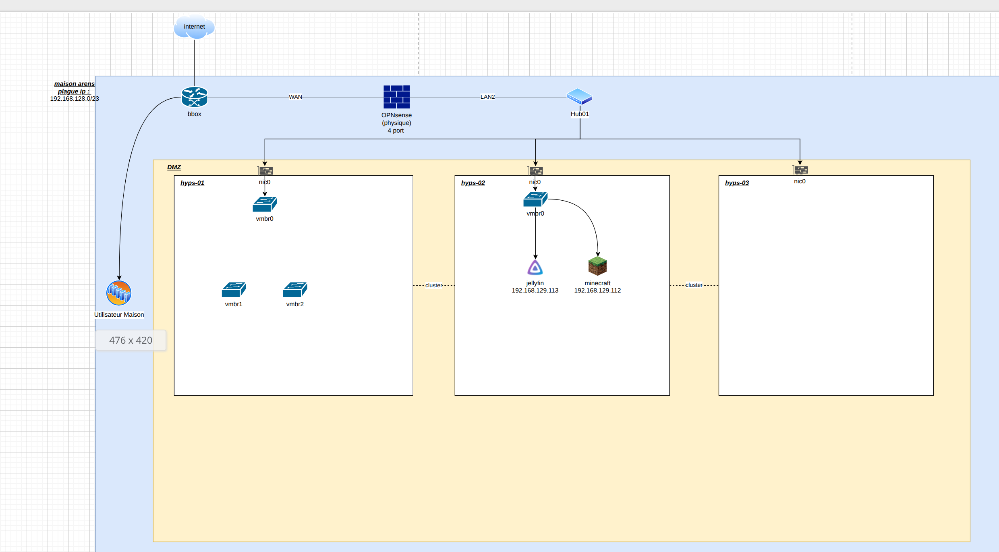

# Distributed_honeypot_with_attack_correlation_TFE

Créez un réseau de honeypots déployés sur différents segments réseau qui partagent leurs données d'attaques. Le système corrèle les informations pour identifier des campagnes d'attaques coordonnées et génère automatiquement des règles de pare-feu.

## chois du projet

pendant mes temps libre j'ai crée un petit homelab cher moi avec differents ordinateur trouver en ocasion sur le net et j'y est installer proxmox dessus j'ai donc une infrastructure de test.

voici un schéma de cette infrastructure :

pour continuer et crée des machines virtuel qui me servirons pour mon infrastructure je vais utiliser un language IaC le candidat qui ma le 
plus plu est opentofu solution opensource qui viens d'un fork de terraform language utiliser par hashiCorp c'est déjà un bon début mais dans 
mes vm je vais vouloir modifier des choses dedans pour pouvoir installer mes honeypots dessus c'est a se moment la que je vais utiliser 
ansible qui va me permetre via ssh de modifier les vm que j'aurais crée pour mon infrastructure.

pour les honeypots je n'ai pas encore choisi mais mon regarde se port plus sur des solutions comme cowrie
